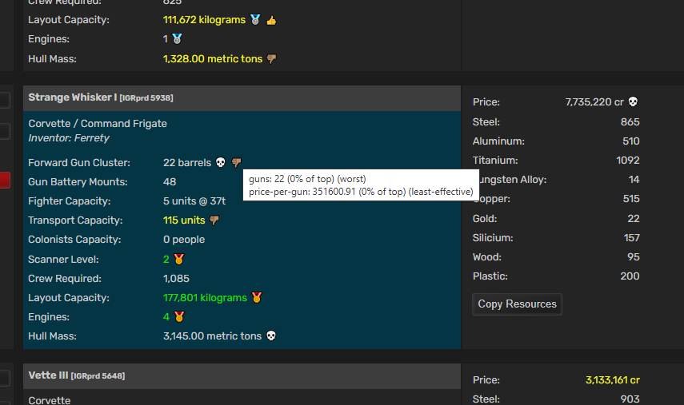

# AtmoBurn Services - Blueprints Colorizer
This is Tampermonkey (https://www.tampermonkey.net/) script for Atmoburn game (https://www.atmoburn.com/).

## What it does
Parses and highlights best/worst/most effective blueprints (per attribute), like:
- best (🥇) attribute (from all you blueprints of this type)
- second best (🥈) attribute
- worst (💀) attribute
- most effective  (👍) - calculated attribute, see tooltip
- least effective  (👎)
- highlights hybrids (to not miss important/interesting blueprints)
- highlights no-res blueprints (detto)
- etc - see screenshot

See tooltips for attribute values / badges - for more details.

## How to install
- You should have Tampermonkey (https://www.tampermonkey.net/) or equivalent
- Open `abs-blueprint-colorizer.user.js` file and go "Raw" in your browser - Tampermonkey should offer you "Install" button - and thats it.

## How to use
Just browse your blueprints - look for colored attribute values, badges (medals...) and see tooltips as well.

## Screenshots

