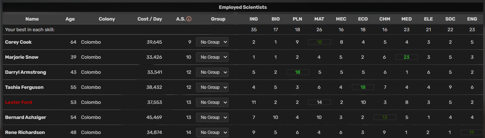

# AtmoBurn Services - Scientists Colorizer
This is Tampermonkey (https://www.tampermonkey.net/) script for Atmoburn game (https://www.atmoburn.com/).

## What it does
Parses and highlights best skill for every scientis and top 5 scientists for all skills.

## How to install
- You should have Tampermonkey (https://www.tampermonkey.net/) or equivalent.
- Open `abs-scientist-colorizer.user.js` file and go "Raw" in your browser - Tampermonkey should offer you "Install" button - and thats it.

## How to use
Just browse your scientist/research pages - and look for:
- colored skill values (5 degrees of green) - top 5 scientists for this skill (from all scientists in that view)
- skill with the (thin) frame - best skill for the scientist
- scientist name is red - this scientist has no skill in top 5

## Screenshots

